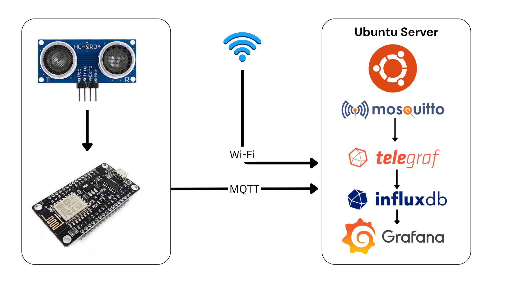

## HomeCore-IoT

### NodeMCU (ESP8266) + Ultrasonic Sensor (HC-SR04) + Mosquito MQTT + InfluxDB + Grafana

In this project, we will build the module of HomeCore-IoT, an IoT-based monitoring and automation platform.

This module will measure the distance between an ultrasonic sensor and the surface of the water in a tank. An ESP8266 will collect the sensor readings and publish them over MQTT to an Ubuntu server.

The Ubuntu server will run Mosquitto, Telegraf, and InfluxDB to receive, process, and store the sensor data. The Grafana will be used to visualize the collected data through a real-time dashboard.



   

This architecture is designed to be expandable. In future stages, we can add humidity sensors, water-flow sensors, light sensors, relays, pumps, lights, and other devices without changing the basic architecture.

### ESP8266 Arduino IDE Setup

Follow the official ESP8266 Arduino Core installation guide:

[ESP8266 Arduino Core - Installing](https://arduino-esp8266.readthedocs.io/en/latest/installing.html)

### Prepare the Ubuntu Server
Use an Ubuntu machine as the central server for HomeCore-IoT.
The server will host:

- Mosquitto MQTT broker
- Telegraf
- InfluxDB
- Grafana
Make sure the Ubuntu server and ESP8266 are connected to the same local network.
## Install Mosquitto
Mosquitto will act as the MQTT broker.

Install Mosquitto and the MQTT command-line clients:

```bash
sudo apt update
sudo apt install mosquitto mosquitto-clients
```
After installation, verify that Mosquitto is running.

You can check the listening ports with:
```bash
sudo ss -lntp | grep 1883
```
You should see Mosquitto listening on MQTT port:
```bash
1883
```
### Test MQTT
Before connecting the ESP8266, test the MQTT broker locally.

Open one terminal and subscribe to a test topic:

```bash
mosquitto_sub -h localhost -t sensors/test
```
Open another terminal and publish a message:

```bash
mosquitto_pub -h localhost -t sensors/test -m "Network test"
```
The subscriber should receive:
```bash
Network test
```
### Test MQTT from another device
You should also verify that MQTT can be accessed through the CLI Ubuntu server's LAN IP.

Use:
```bash
mosquitto_sub -h <MQTT BROKER IP> -t sensors/test
```
Then publish a message from another device:
```bash
mosquitto_pub -h <MQTT BROKER IP> -t sensors/test -m "Network test"
```
If the message is received, MQTT is accessible over the LAN.

### Test ESP8266 Wi-Fi
Before connecting the ultrasonic sensor or MQTT, verify that the ESP8266 can connect to your Wi-Fi network.

Use a 2.4 GHz Wi-Fi network because the ESP8266 does not support 5 GHz Wi-Fi.

Open the Arduino Serial Monitor and set the baud rate to: 115200
After uploading the Wi-Fi test program, verify that the ESP8266 connects successfully and prints its IP address.

### Test MQTT from the ESP8266
After confirming that Wi-Fi works, configure the ESP8266 to connect to the MQTT broker.

The MQTT server is:
```bash
<YOUR IP>:1883
```
For the initial MQTT test, publish:
```bash
Hello from ESP8266!
```
to:
```bash
sensors/test
```
On the Ubuntu server, monitor the topic with:

```bash
mosquitto_sub -h localhost -t sensors/test
```
### Configure the HC-SR04 and MQTT
Once Wi-Fi and MQTT have been tested independently, connect the HC-SR04 and upload the complete ESP8266 program.

The program performs the following tasks:

- Connects to Wi-Fi.
- Connects to the MQTT broker.
- Initializes the HC-SR04.
- Measures the distance.
- Converts the measurement into centimeters.
- Publishes the measurement through MQTT.
- Reconnects to MQTT if the connection is lost.
- Repeats the process approximately every second.
  
Use the following code:
Follow the homecore-iot.ino
Replace:
```bash
YOUR_WIFI_SSID
YOUR_WIFI_PASSWORD
```
with your own Wi-Fi credentials.
### Verify the MQTT Sensor Data
The ESP8266 publishes ultrasonic measurements to:
```bash
sensors/ultrasonic/distance
```
Example values may look like:
```bash
42.37
41.92
41.55
40.81
```
These values represent the measured distance in centimeters.

To monitor the values directly from Ubuntu, run:
```bash
mosquitto_sub -h localhost -t sensors/ultrasonic/distance
```
You should see new values approximately every second.

## Install InfluxDB with Docker

InfluxDB will be used to store the time-series data collected from the ESP8266 sensors.

### 1. Pull the InfluxDB Docker Image

```bash
docker pull influxdb:2
```

### 2. Create an InfluxDB Container

Run the following command:

```bash
docker run -d \
  --name influxdb \
  --restart unless-stopped \
  -p 8086:8086 \
  influxdb:2
```

### 3. Verify the Container

Check that the InfluxDB container is running:

```bash
docker ps
```

You should see a container similar to:

```text
influxdb
```

You can also check the container logs:

```bash
docker logs influxdb
```

### 4. Open the InfluxDB Web Interface

Find the IP address of your Ubuntu server:

```bash
hostname -I
```

Then open the following address in your web browser:

```text
http://YOUR_SERVER_IP:8086
```

### 5. Initial InfluxDB Setup

When you open InfluxDB for the first time, create your initial account and configure:

- **Username**
- **Password**
- **Organization**
- **Bucket**
- **API Token**

Keep the API token secure. Do not upload the real token to GitHub.

You will need the following values later when configuring Telegraf and Grafana:

```text
InfluxDB URL:    http://YOUR_SERVER_IP:8086
Organization:    YOUR_ORGANIZATION
Bucket:          YOUR_BUCKET
Token:            YOUR_INFLUXDB_TOKEN
```

### 6. Verify InfluxDB

After completing the initial setup, open the InfluxDB **Data Explorer** and verify that the server is accessible.

At this stage, InfluxDB is ready to receive sensor data from Telegraf.


### Configure Telegraf
Telegraf will act as the bridge between MQTT and InfluxDB.

Its job is to:

- Subscribe to MQTT topics.
- Receive sensor values.
- Convert the MQTT data into a format suitable for InfluxDB.
- Write the measurements into InfluxDB.
Create a directory for the Telegraf configuration:
```bash
mkdir -p ~/telegraf
```
Create the configuration file:
```bash
~/telegraf/telegraf.conf
```
Use the following configuration:
```bash
[agent]
  interval = "1s"
  flush_interval = "1s"

[[inputs.mqtt_consumer]]
  servers = ["tcp://192.168.1.30:1883"]

  topics = [
    "sensors/ultrasonic/distance"
  ]

  qos = 0

  data_format = "value"
  data_type = "float"

[[outputs.influxdb_v2]]
  urls = ["http://192.168.1.30:8086"]

  token = "YOUR_INFLUXDB_TOKEN"
  organization = "YOUR_ORGANIZATION"
  bucket = "YOUR_BUCKET"

```
Replace:
```bash
YOUR_INFLUXDB_TOKEN
YOUR_ORGANIZATION
YOUR_BUCKET
```

with your actual InfluxDB configuration.

The important MQTT topic must match the topic used by the ESP8266:
```bash
sensors/ultrasonic/distance
```
The flush_interval is set to:
```bash
ls
```
### Run Telegraf with Docker

Create the Telegraf container using:
```bash
docker run -d \
  --name telegraf \
  --restart unless-stopped \
  -v ~/telegraf/telegraf.conf:/etc/telegraf/telegraf.conf:ro \
  telegraf
```
Verify that the container is running:
```bash
docker ps
```
Then check the Telegraf logs:
```bash
docker logs telegraf
```
Look for a successful MQTT connection similar to:
```bash
[inputs.mqtt_consumer] Connected [tcp://192.168.1.30:1883]
```
This confirms that Telegraf can connect to Mosquitto.

### Verify Data in InfluxDB
Open the InfluxDB web interface:
```bash
<YOUR IP>:8086
```
Open the data explorer and check whether new ultrasonic measurements are being stored.
### Configure Grafana
Grafana will be used to create the monitoring dashboard.

If Grafana is already running in Docker, you do not need to create another Grafana container.

Because Grafana is running inside Docker, localhost does not refer to the Ubuntu host.

For example:
```bash
localhost:8086
```
from inside the Grafana container would refer to the Grafana container itself.

Instead, determine the Docker host gateway.

In this setup, the Docker bridge gateway is:
```bash
172.17.0.1
```
Therefore, Grafana can reach InfluxDB using:
```bash
http://172.17.0.1:8086
```
### Add InfluxDB as a Grafana Data Source
Open Grafana and add a new InfluxDB data source.

Configure it with:
```bash
Query language: Flux
URL: http://172.17.0.1:8086
```
Use the InfluxDB organization, bucket, and API token created earlier.

Do not enable Basic Authentication unless you have specifically configured InfluxDB to use it.

Test the connection.

The data source should report a successful connection.

### Configure Grafana Query Settings
For the ultrasonic monitoring dashboard, use:
```bash
Query language: Flux
Minimum time interval: 1s
Max series: 1000
```
The minimum interval of 1s allows Grafana to work with the approximately one-second sensor update interval.

### Create the Distance Time-Series Panel
Create a new Grafana dashboard and add a Time series panel.

Use the following Flux query:
```bash
from(bucket: "YOUR_BUCKET")
  |> range(start: -5m)
  |> filter(fn: (r) => r._field == "value")
```
Replace:
```bash
YOUR_BUCKET
```
with the actual InfluxDB bucket name.

Configure the panel to display the unit as:
```bash
centimeters (cm)
```
Set the dashboard time range to:
```bash
Last 5 minutes
```
Set the dashboard refresh interval to:
```bash
ls
```
The panel should now display the ultrasonic distance measurements over time.
### Create the Current Distance Panel
Create another panel using the Stat visualization.

Use:
```bash
from(bucket: "YOUR_BUCKET")
  |> range(start: -1m)
  |> filter(fn: (r) => r._field == "value")
  |> last()
```
Set the unit to:
```bash
centimeters (cm)
```
This panel will display the most recent ultrasonic measurement.

For example:
```bash
42.4 cm
```
The completed first stage of HomeCore-IoT can be summarized as:

                    ┌──────────────────┐
                    │     HC-SR04      │
                    │ Ultrasonic Sensor│
                    └────────┬─────────┘
                             │
                             ▼
                    ┌──────────────────┐
                    │     ESP8266      │
                    │   Sensor Node    │
                    └────────┬─────────┘
                             │
                           Wi-Fi
                             │
                             ▼
                    ┌──────────────────┐
                    │    Mosquitto     │
                    │   MQTT Broker    │
                    └────────┬─────────┘
                             │
                             ▼
                    ┌──────────────────┐
                    │     Telegraf     │
                    │ Data Collector   │
                    └────────┬─────────┘
                             │
                             ▼
                    ┌──────────────────┐
                    │     InfluxDB     │
                    │  Time-Series DB  │
                    └────────┬─────────┘
                             │
                             ▼
                    ┌──────────────────┐
                    │     Grafana      │
                    │    Dashboard     │
                    └──────────────────┘

The first objective of HomeCore-IoT is therefore:

Measure → Transmit → Collect → Store → Visualize

The next stage can extend this architecture from simple monitoring into automated control, allowing HomeCore-IoT to not only observe the environment but also make decisions and control connected devices.


